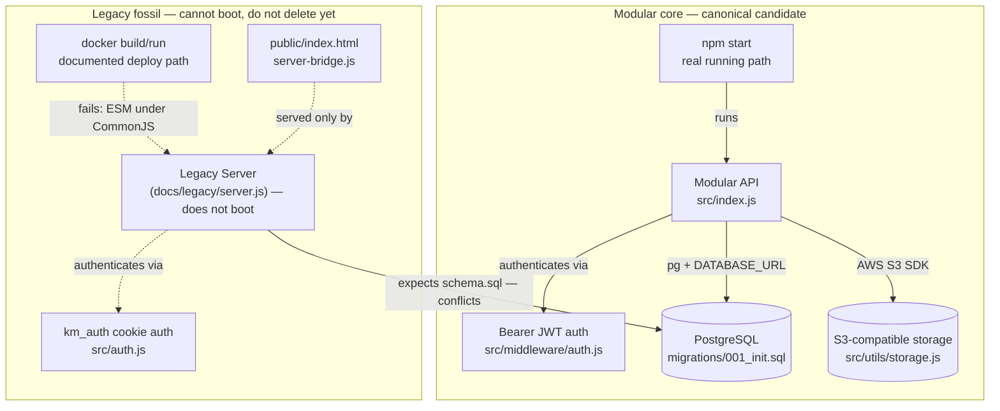
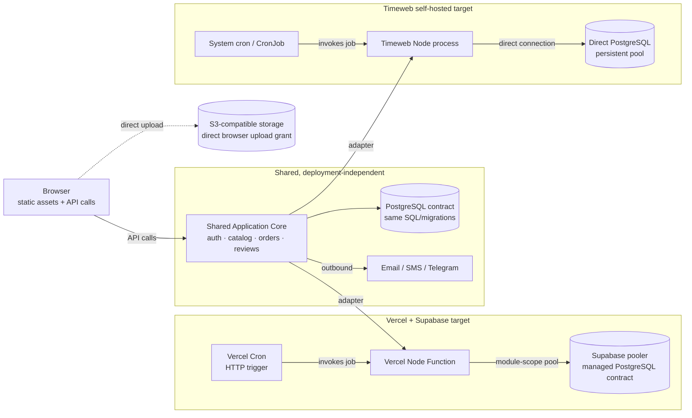
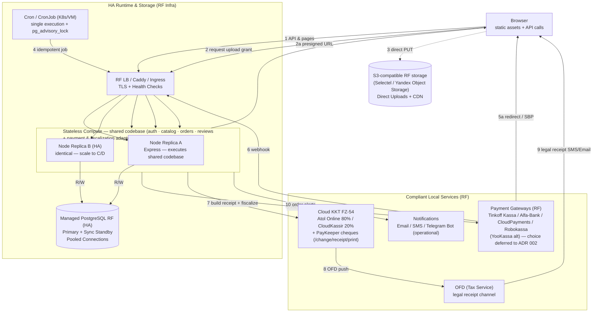

# ADR 001: Canonical Core, Deployment Architecture, and Master Decision Matrix

- **Status:** Accepted — 2026-09-13 (decided today per maintainer; split from ADR 002)
- **Date:** 2026-09-13 (amended 2026-09-13 17:29 UTC RF-only; 20:00 UTC 5000 WAU HA; 19:10 UTC license closed; 19:30 UTC external diagram feedback; 19:36 UTC split)
- **Deciders:** @Dahgoth (maintainer), @annatchijova (collaborator)
- **Related:** Issue #3 (divergent servers) incl. comments 5650018690/5650145815/5650224627/5653517595, Issue #6 closed by PR #10, Issue #8 (master matrix), PR #7 (diagrams), `docs/2026-hosting-pricing-research.md` §11 Scenario R
- **Amendment 2026-09-13:** RF-only hosting (blockages/152-FZ); 5000 WAU HA from day one (cheapest HA); payments standard YooKassa/Tinkoff/Robokassa + Alfa-Bank/CloudPayments alternates with PayKeeper cheques; fiscalization Atol Online 80% / CloudKassir 20% (FZ-54); external diagram feedback incorporated; hosting + primary/fallback payment choice deferred to ADR 002; A1-A3 legacy = inspiration-only; A4 = pure C API-only (no half-measures)

## Context

### Issue #3: Two divergent servers, one un-runnable

| Concern | `src/index.js` (active, `npm start`) | `docs/legacy/server.js` (Docker legacy) |
|---|---|---|
| Module system | CommonJS, `type: commonjs` — boots | ESM `import` — `SyntaxError: Cannot use import outside a module` |
| DB contract | `{query, getClient, pool}` + `migrations/001_init.sql` + runner | imports `{initSchema, query, tx}` — missing |
| Dependencies | declared | `compression`, `cookie-parser`, `node-cron` — undeclared |
| Auth | Bearer JWT `middleware/auth.js` | cookie `km_auth` `src/auth.js` |
| Env | `src/config.js`: `SMTP_PASSWORD`, `SMS_PROVIDER_API_URL`, `TELEGRAM_*`, `FRONTEND_ORIGIN`, `PORT` 4000 | `SMTP_PASS`, `DOMAIN`, `ADMIN_EMAIL/PASSWORD`, `MAX_UPLOAD_MB`, `GOOGLE_SERVICE_ACCOUNT_JSON`, `PORT` 3000 |
| Endpoints | `POST /api/auth/forgot-password` / `reset-password` | `POST /api/auth/forgot` / `reset` |

`Dockerfile` targeted `docs/legacy/server.js` (formerly `src/server.js`, now archived; `Dockerfile` deleted) via `CMD ["node","src/server.js"]` + `EXPOSE 3000` vs `README`/`ENVIRONMENT.md`/`config.js` port 4000 — documented Docker path crashes. Security findings excluded (private channel).

Target topology from Issue #3 comments (originally dual-track):

```
shared application / API / domain logic
        |
PostgreSQL + S3-compatible storage + notifications
        |
Vercel Functions + Supabase Postgres     Timeweb Node container/process
```

**Amendment RF-only (2026-09-13 17:29 UTC):** All hosting RF-only (152-FZ, blockages). Dual-track Vercel+Supabase **superseded** — not deployable for personal data. Canonical is RF HA (Selectel/Timeweb/Yandex Cloud RF region, managed PG, LB/ingress, RF object storage). Vercel adaptations kept as historical notes only.

**Amendment 5000 WAU HA (2026-09-13 20:00 UTC):** Target raised 5000 WAU (from 1000) with HA from day one, cheapest HA. Gateway set expanded to Tinkoff/Alfa-Bank/CloudPayments/Robokassa (+YooKassa alt) with Atol 80%/CloudKassir 20% + PayKeeper cheques. §11 recomputed for 5k WAU cheapest HA.

Principles (final): one API/auth/schema contract (`src/index.js` + 7 routers + 2 middleware + `config.js`/`db.js` + `migrations/`); runtime is RF HA; `PostgreSQL` stays `PostgreSQL` (managed HA, no Supabase in prod); custom JWT unified; media via RF S3 presigned grant (see presigned handshake below); migrations single CI/release job with advisory lock; payments+fiscalization are narrow required boundaries; no generic multi-cloud abstraction.

Modular core is only runnable path. Legacy family (`docs/legacy/server.js` (formerly `src/server.js`), `src/auth.js`, `src/mail.js`, `src/sheets.js`, `src/payment-adapters/`, `public/index.html`+`server-bridge.js`, `src/schema.sql`, `scripts/init-db.js`) is fossil — not `DEAD_WEIGHT`; treated **inspiration-only** per maintainer (audit non-blocking, see §1).

Diagrams: Mermaid verbatim from Issue #3 comment 5653517595 (renders in GitHub); PNG fallbacks in PR #7 `docs/architecture/current-fracture.png`/`target-architecture.png`; interactive pan/zoom `file:line` versions sent directly (not embeddable). **Target updated to RF-only HA optimized** per external feedback — history preserved, optimized below is canonical.

#### Current fracture (verbatim from 5653517595 — unchanged)



#### Historical target (verbatim dual-track from 5653517595 — superseded, kept for traceability)



#### Target architecture — RF-only HA optimized (canonical, incorporates external feedback)

Incorporates external review (2026-09-13) fixing: unified stateless replicas (core inside replicas, not external `core --> app`), fiscalization orchestration via app (not `paygw --> kkt` one-way), OFD/legal receipt vs operational notify split, presigned URL handshake. Corrects two issues in proposed optimized diagram: cron fan-out duplication (single execution + advisory lock) and LB traversal.



External feedback evaluation: 1) abstract `Shared Application Core` → valid, fixed (code inside replicas); 2) circular `paygw<->kkt` → valid, fixed (app orchestrates webhook → fiscalize); 3) OFD vs notify → valid, split; 4) S3 presigned handshake → valid, numbered 2/2a/3. Adopted with two corrections noted above.

### Issue #8: Master decision matrix

Issue #8 consolidates Groups A-E where `Решение` is maintainer-filled — nothing yet decided (no comments as of 2026-09-13). Order: Group A blocks B/D; C and E parallel. Group C (AGPL) now resolved (see below).

### License — Group C11 resolved

Issue #6 (`AGPL-3.0` §13 vs white-label) **closed 2026-09-13 by PR #10** `chore(license): relicense from AGPL-3.0 to MIT` (merged 2026-09-13T14:58:07Z, `closingIssuesReferences: [#6]`). Change: `LICENSE` AGPL→MIT, `package.json` license field, `README`/`AGENTS.md`/`CONTRIBUTING.md` references, `CHANGELOG` under `[Unreleased]`. MIT is permissive, no network source-disclosure for white-label. No further decision in this ADR; Group C11 marked resolved.

### Maintainer answers final (2026-09-13)

- **Port:** env-driven, no default (fail-closed).
- **Hosting:** cheapest HA — vendor/price comparison deferred to ADR 002 (Timeweb vs Yandex).
- **Payments:** narrow adapter now, primary/fallback choice deferred to ADR 002 (Tinkoff/Alfa/CloudPayments/Robokassa).
- **Fiscalization:** Atol 80%/CloudKassir 20% + PayKeeper deferred to PO decision 2026-09-14.
- **Storage:** RF S3 provider deferred to ADR 002 (Timeweb/Selectel/Yandex) — verify ACL.
- **License:** resolved via PR #10 MIT.
- **Capacity 5k WAU HA:** accepted §11.1 model.
- **A1-A3:** inspiration-only, modular canonical — audit non-blocking (propose scope).
- **A4 frontend:** **pure C** API-only, no half-measures — DESIGN.md derived, rebuild separately preserving UX with minimal security/usability fixes.

## Decision

### 1. One canonical application core — Group A (inspiration-only for legacy)

| # | Decision | Modular (`src/index.js`) | Legacy (`docs/legacy/server.js`) | Options | Decision |
|---|---|---|---|---|---|
| A1 | Canonical auth | Bearer JWT + role from DB (`middleware/auth.js`) | cookie `km_auth` | modular / legacy / both | **Modular canonical** — legacy `km_auth` inspiration-only |
| A2 | Canonical API surface | `/api/*`, 7 routers | separate monolith + storefront | modular / carry over | **Modular canonical** — legacy inspiration-only for behavior notes |
| A3 | Canonical schema lineage | `migrations/001_init.sql` (runner, `audit_log`, `payment_webhook_events`) | `src/schema.sql` (conflicting) | modular / legacy / merge | **Modular lineage canonical** — `schema.sql` inspiration-only |
| A4 | Embedded frontend | none (API-only) | `public/index.html`+`server-bridge.js` (cookie-auth) | keep / replace / remove | **Pure C API-only** — see §1a |
| A5 | Status-transition scheduler | absent | resident `node-cron` (`server.js:122`) | rework / remove | **Rework as idempotent job with leader election** if business rule needed, otherwise remove — never resident timer |
| A6 | Payment provider + verification | generic webhook + `payment_webhook_events` | empty adapter registry | choose provider | **Narrow adapter decided** — concrete primary/fallback deferred to ADR 002 |

Legacy family quarantined (excluded from build/lint), `Dockerfile` fix **unblocked** — no parity gate. Inspiration-only means behavior notes captured in non-blocking audit annex (proposed scope: `km_auth` flow, `site_state`/`seed.json` vs `001_init` (`products`/`categories`/`orders`/`reviews`), `schema.sql` diff, `sheets.js` Sheets, `payment-adapters` concept, `public/index.html` monolith, `scripts/init-db.js`/`reset-admin.js`), owner/timeline proposed in §1b but not blocking.

#### 1a. Frontend disposition — pure C (no half-measures)

**Decision: Pure C — backend is API-only.**

Backend (`src/index.js`) serves only `/api/*` (no `express.static` for `public/`). `public/index.html` (540 KB) + `server-bridge.js` fully decoupled — not served from Node, not shimmed. New frontend is built **separately** (RF static + CDN, e.g., Selectel/Yandex Object Storage CDN or Timeweb S3/CDN) as a standalone artifact consuming modular Bearer JWT API.

PO constraint: preserve **original UX/UI with minimal security and usability improvements**. `DESIGN.md` is **derived, not source of truth** — it was built after PO codebase. Flow: rebuild FE pixel-perfect on modular API preserving all tokens/copy/flows, then **regenerate `DESIGN.md` from implemented FE** post-rebuild. Allowed minimal fixes (only):

- XSS sanitization, CSP headers (`frame-ancestors`, `base-uri`), no inline handlers beyond existing bundle;
- `FRONTEND_ORIGIN` CORS allowlist (replace wildcard + credentials, E14);
- `Authorization: Bearer` header (replace `km_auth` cookie + CSRF);
- a11y: focus-visible, `44px` touch targets, keyboard for drawer/modal;
- mobile drawer/table/price-import UX fixes;
- presigned S3 grant handshake (fix `browser -.-> storage` without Node proxy).

Tech/hosting deferred: propose Vite (fastest for single-file 540 KB migration) vs Next.js if SSR needed — **ADR 002 decision** with repo split (`kompmaster-server` API vs `kompmaster-frontend` static). Timeline: lift not in ADR 001 — phase 0 is API-only cutover (no serving `public/`), FE rebuild tracked separately.

Why pure C is safer: isolates origin (API vs static CDN), strict CORS/CSP per origin, no Node serving 540 KB on event loop, enables LB health checks, CDN cache without backend surface; scalable to 5k WAU HA (stateless replicas + managed PG + Redis for E15).

Hybrid B-light / A (keep legacy or shim) explicitly rejected as half-measure for ADR 001 — would perpetuate fractured contract.

#### 1b. Audit — proposed non-blocking scope

Scope: `src/auth.js` cookie flow, `mail.js`/`sheets.js` Sheets, `payment-adapters/` plugin concept, `src/schema.sql` vs `001_init.sql` structural diff, `public/index.html`+`server-bridge.js` contract, `seed.json`/`site_state`, `scripts/init-db.js`/`reset-admin.js` ops scripts. Deliverable: annex table mapping legacy behavior → disposition (drop / re-implement on modular API / discard). Owner: propose @annatchijova draft + @Dahgoth approval, timeline 3–5 days, **does not block** Dockerfile/Caddyfile/port fix.

### 2. PostgreSQL as contract — RF-only HA (supersedes Group B7 dual-track)

- App depends on **PostgreSQL + transactional provider**, **HA from day one, cheapest HA**.
- **RF production:** **managed PostgreSQL HA** (Selectel Managed PG / Timeweb Cloud DB HA / Yandex Managed PG — primary + standby, auto-failover) with `DATABASE_URL` `target_session_attrs=read-write`, per-replica `pg.Pool` max 15–20. Not colocated single-VPS PG for 5k WAU.
- Custom JWT unified; no Supabase Auth/RLS (historical note only).
- Concrete vendor/price + region (MSK vs SPB) deferred to ADR 002 cheapest-HA comparison; PG PITR/cross-region DR deferred.

### 3. Object storage — RF S3 presigned grants (B8, provider deferred)

- Direct browser upload via presigned grant (`browser --grant--> LB/apps --presigned URL--> browser --PUT--> RF S3 + CDN`). Corrects prior `browser -.-> storage` without handshake. On RF, grant still preferred to keep replicas stateless.
- **RF S3:** Selectel / Yandex Object Storage / Timeweb S3 via AWS S3 SDK (`forcePathStyle: true`), `S3_ENDPOINT`/`S3_BUCKET`/`S3_PUBLIC_URL` contract. Concrete provider/CDN deferred to ADR 002 cheapest-HA comparison (verify ACL/public-URL/presigned policy first).

### 4. Periodic tasks — idempotent jobs on RF HA

`node-cron` resident timer removed. Idempotent handler invoked once per schedule via Cron/CronJob on RF infra with `pg_advisory_lock` / leader election (since ≥2 replicas, E17). Migrations: one CI/release job (`npm run migrate`) with advisory lock, never on request path. Covers B9 (Realtime — defer) and B10 (multi-tenancy/queue — defer; §11 shows queue only for KKT retries/imports).

### 5. Port and config — env-driven, no default (RF containers)

**Env-driven, no default.** `PORT` required; missing/invalid fails startup (fail-closed). `config.js` fallback `4000` and Docker `3000` removed. `Dockerfile`/`docker-compose.yml`/`Caddyfile`/`README`/`DEVELOPMENT.md`/`DEPLOY.md` must read `PORT` from env (`{$PORT}` / `{$DOMAIN}`) with no hardcoded `EXPOSE`. (Group D12 fail-closed — private checklist tracked separately.)

### 6. Payments — RF standard adapter (choice deferred to ADR 002)

Standard set per constraints: **Tinkoff Kassa / Alfa-Bank (payment.alfabank.ru) / CloudPayments / Robokassa** (+ YooKassa alt) with PayKeeper cheques + Atol 80%/CloudKassir 20% (FZ-54). **Decision in ADR 001:** narrow adapter pattern only; **concrete primary/fallback deferred to ADR 002** (cheapest HA + contract owner/cost/OFD).

| Provider | Type | Rate signal (cards excl. VAT) | SBP | VAT 22% (425-FZ) | FZ-54 |
|---|---|---|---|---|---|
| Tinkoff Kassa | Bank | Individually (trading ref from 1.2%) | 0.2%/0.4%/0.7% (CBR 686); SBP no VAT | +22% cards, no VAT SBP & T-Pay; 50% comp H2 2026 if ≤20M₽/yr | Atol/CloudKassir + PayKeeper |
| Alfa-Bank | Bank | 2.6% tomorrow / 2.7% instant / 1,690₽/mo ≤2M₽ (excl. VAT; >2M₽→2.6%); promo 1% 3mo; Alfa Pay no VAT | ≤0.7%; Alfa Pay no VAT | +22% cards, SBP/Alfa Pay no VAT | Free cloud KKT included |
| CloudPayments | Aggregator (T-Bank) | ~2.6% individually | Individually | +22% incl. SBP | CloudKassir + PayKeeper |
| Robokassa | Aggregator | ~2.9% (2.9–3.9%), SBP 0.4–0.7% | 0.4–0.7% | +22% | Atol/CloudKassir + PayKeeper |
| YooKassa alt | Aggregator | Base 3.5%; promo 2.8%+1% until 2026-12-01 | Individually | +22% | Built-in or Atol/CloudKassir |
| Fiscalization | Cloud KKT | Per receipt/FN (1,400–2,400₽/mo cloud) | — | VAT separate | Atol 80%/CloudKassir 20% + PayKeeper |

Adapter: `payment provider` `createPayment`/`verifyWebhookSignature`/`refund` + separate `fiscalization` `fiscalizeReceipt(order, items)` idempotent by `payment_webhook_events.id`/`receipt_key` (PayKeeper `a-zA-Z0-9_-`, 6+ chars, `Callback о статусе чека`). **Flow:** `gateway webhook` → `verify` → `mark idempotent` → `fiscalize` (Atol/CloudKassir or Alfa bundled or PayKeeper) → `callback/retry` → `order status`. HA needs idempotency across replicas.

### 7. Hosting — RF-only HA cheapest (concrete choice deferred to ADR 002)

RF-only HA cheapest per maintainer. **Decision in ADR 001:** HA principle + cheapest; **concrete vendor/shape deferred to ADR 002 price comparison (Timeweb vs Yandex Cloud)**.

Order (RF-only HA):

1. Canonical contract + env-driven port + E17 advisory lock + E15 distributed limiter (§1–5, §10) — 2026-09-13
2. Narrow boundaries: RF S3 grants + gateway adapter + fiscalization adapter (§6)
3. RF HA deploy: managed PG HA + ≥2 app replicas + LB/Caddy + S3/CDN + secrets — vendor from ADR 002
4. Observability: structured logs, PG slow-query, synthetic checks, Telegram alerts, SLO burn
5. Load & chaos: k6/Artillery 40–50 RPS sustained, 80 RPS burst + 10–15 concurrent checkouts + PG failover drill — validate `FOR UPDATE` + KKT retry under HA
6. Security: D12 fail-closed + D13 webhook verify + CORS (E14) + `xlsx` isolation (E16)

### 8. License — Group C resolved

AGPL-3.0 vs white-label (Issue #6 / Group C11) **resolved 2026-09-13 by PR #10** `chore(license): relicense from AGPL-3.0 to MIT` — `LICENSE` `package.json` `README`/`AGENTS.md`/`CONTRIBUTING.md` `CHANGELOG` updated. MIT = white-label compatible. No further decision.

### 9. Security fixes — Group D (private)

Issue #8 D12 (config fail-closed) and D13 (payment webhook must verify provider signature) — details private via @annatchijova. Tracked separately. D12 partially satisfied by env-driven `PORT` + required `JWT_SECRET`/`DATABASE_URL`; D13 depends on §6 gateway chosen (YooKassa/Tinkoff/Alfa/CloudPayments/Robokassa signature) + Atol/CloudKassir/PayKeeper fiscalization.

### 10. Tech debt — Group E (propose fix-now)

| # | Item | Evidence | Decision |
|---|---|---|---|
| E14 | CORS wildcard + credentials | `src/index.js:17-21` | **Fix now** — validated `FRONTEND_ORIGIN` allowlist (needed for pure C static CDN) |
| E15 | In-process rate limiting does not survive HA | `src/middleware/rateLimit.js:6-31` | **Fix before HA** — Redis or PG-backed limiter; in-process broken with ≥2 replicas at 5k WAU |
| E16 | `xlsx` 2 HIGH vulns (Prototype Pollution, ReDoS) | `src/utils/priceImport.js`, admin-only | Keep admin-only with isolation/worker; replace lib before scale (not blocking HA) |
| E17 | Migration runner no parallel-run lock | `src/migrate.js:12-44` | **Fix before HA** — `pg_advisory_lock` mandatory |

### 11. High-level design & capacity plan for 5000 WAU — RF HA cheapest prod

Target **5000 WAU**, HA cheapest from day one. Replaces 1000 WAU single-VPS. §11.1 model accepted per maintainer.

#### 11.1 Traffic model (accepted for 5000 WAU)

| Metric | Assumption | Derivation |
|---|---|---|
| WAU | 5,000 | given |
| DAU (avg) | ~900–1,400 | 18–28% WAU |
| Peak-hour concurrent | 150–350 | 15–25% DAU, 5–10 min session |
| Requests/session | 15–30 | catalog + S3/CDN + 1–2 mutations |
| Avg API RPS (peak) | 8–20 RPS, bursts 30–50 (promo 60–80) | concurrents × 0.05–0.1 req/s |
| Orders | 100–250 / week (2–5% conversion) | stock `SELECT … FOR UPDATE` |
| Admin concurrency | 5–10 | price import, moderation |
| Uploads | hundreds / week | product/category/review photos |
| SMS OTP | 1,000–2,000 / week | phone confirmation |

#### 11.2 RF HA cheapest topology (from §11 canonical diagram above)

- **Compute:** 2× app replicas (stateless, shared codebase) behind RF LB/Caddy (TLS + health `/api/health`, `least_conn`). Scales to C/D on seasonal spike.
- **DB:** managed PostgreSQL HA (primary + sync standby, pooled connections, auto-failover, PITR). Per-replica `pg.Pool` max 15, cluster max ~30.
- **Storage:** RF S3 + CDN (Direct Uploads). Presigned URL flow 2/2a/3 as diagram.
- **Cache/coordination:** Redis for E15 distributed limiter + webhook/KKT idempotency guard (deferred to cheapest-HA vendor choice — include in ADR 002 costing).
- **Payments+fiscalization:** app orchestrates (diagram 5/6/7): `init invoice` → `redirect/SBP` → `webhook via LB` → `fiscalize` → `OFD` → `legal receipt` + `notify` split (10).
- **Cron:** single execution via advisory lock (not fan-out to both replicas).
- **Backups/DR:** managed PG PITR + nightly `pg_dump` gzip → RF S3 (7–30 days); S3 versioning; restore drill quarterly.

Concrete vendor pricing (Timeweb vs Yandex) deferred to ADR 002; order-of-magnitude for HA cheapest at 5k WAU ~4–6.5k₽/mo infra (2× app + managed PG HA + S3/CDN) vs ~1k₽ single VPS (insufficient per HA requirement — historical only).

#### 11.3 Data & concurrency

- **PostgreSQL HA:** `migrations/001_init.sql`, `getClient()` `FOR UPDATE` safe to ~50 concurrent checkouts at 5k WAU peaks (100–250/wk = 1–2/min, promo burst 10/min needs load test). Mandatory `pg_advisory_lock` for `migrate.js` + cron leader election.
- **Indexes:** `products (category_id, sort_order)`, `orders (status, created_at)`, `users (login)`, `payment_webhook_events (idempotency_key)`.
- **No queue/bus yet** (B10 defer): webhook + async KKT callback with retry keyed by `receipt_key`; introduce queue only when retries exceed timeout or `xlsx` blocks event loop.
- **Rate limiting:** distributed via Redis/PG before HA (attacker can 2× in-process limit).

#### 11.4 SLOs (HA, 5k WAU)

| Area | SLO (30-day) | Metrics |
|---|---|---|
| Availability | 99.9% (~43m) — HA with replica + managed PG; stretch 99.95% | LB health, `up{replica}`, PG primary/standby, 5xx <0.2% |
| Latency API | p50 <100ms, p95 <350ms, p99 <800ms | histogram by route; alert p95 >500ms 10m |
| DB HA | p95 query <60ms; pool wait <30ms; failover <60s | `pg_stat_statements`, pool wait, replication lag, slow >150ms |
| Payments→fiscalization | webhook→KKT success 99.9% (retry `receipt_key`) | `payment_webhook_events`, PayKeeper status, OFD errors |
| Uploads | grant→S3 PUT 99.7% | S3 4xx/5xx, grant expiry, CDN hit ratio |
| SMS/Email/Telegram | 98% | provider callback, queue depth |
| Headroom | peak RPS <40% of 2-replica capacity | CPU/mem per replica, event-loop lag, PG conns, S3 egress |

#### 11.5 Build order (replaces 1k WAU order)

1. Canonical contract + env-driven port + E17+E15 (§1–5, §10) — 2026-09-13
2. Narrow boundaries: RF S3 grants + gateway adapter + fiscalization (Atol 80%/CloudKassir 20% + PayKeeper)
3. RF HA deploy: managed PG HA + 2+ replicas + LB/Caddy + S3/CDN — vendor from ADR 002
4. Observability: logs, slow-query, synthetic, Telegram, SLO burn
5. Load & chaos: 40–50 RPS sustained, 80 RPS burst + 10–15 concurrent checkouts + PG failover drill
6. Security: D12+D13 + CORS (E14) + `xlsx` isolation (E16)

## Consequences

**Positive:** single source of truth, Dockerfile unblocked (inspiration-only audit non-blocking), pure C isolates FE/BE origins (strict CORS/CSP, CDN cache, stateless HA), RF-only compliance, corrected presigned/OFD/fiscalization flows, 5k WAU HA cheapest with concrete SLOs/traffic model.

**Cost:** new FE build required (pure C), fiscalization async domain (gateway→KKT→OFD retry via `receipt_key`), distributed limiter + advisory lock required before HA, hosting+fiscal choice deferred to ADR 002.

**Neutral:** `PORT` no fallback; DESIGN.md regenerated post-rebuild; license MIT.

## Alternatives Considered

- Option B (adopt `docs/legacy/server.js`): rejected — ESM crash, higher effort.
- Option C (keep both in sync): rejected — double maintenance.
- Supabase/Vercel: superseded by RF-only.
- Proxy upload: viable on RF but grant preferred — keep grant (presigned handshake).
- Port fallback: rejected (env-driven).
- Hybrid B-light / A (keep/shim legacy FE): rejected for ADR 001 — half-measure perpetuates fracture; pure C chosen.
- Hybrid vs pure B rebuild: pure C chosen over B (serving FE from Express) for security/system-design isolation; B would couple origins and keep legacy `site_state` shape.
- Single VPS at 5k WAU: rejected per HA day-one.
- Payments without KKT: rejected — non-compliant B2C.
- Queue/bus at 5k WAU: deferred per B10.

## Open Questions → ADR 002 (postponed per maintainer)

> Remaining decisions moved to ADR 002 (2026-09-14 per PO). Security D12/D13 private; license C11 resolved.

1. **Hosting — cheapest HA vendor:** Timeweb Cloud vs Yandex Cloud (vs Selectel) price comparison for managed PG HA + LB/Caddy + RF S3/CDN + Redis at 5k WAU (MSK vs SPB, monthly ceiling).
2. **Payments — primary/fallback:** Among Tinkoff Kassa / Alfa-Bank / CloudPayments / Robokassa (+YooKassa alt), which is primary gateway for MVP and which is fallback/negotiation lever? Need individual quotes with VAT + SBP terms to compare blended rate.
3. **Fiscalization split:** Atol 80%/CloudKassir 20% + PayKeeper vs Alfa free KKT — what decides split (contract owner, cost/OFD, PayKeeper wiring `paykeeper.ru/solutions/cheques`)? PO decision 2026-09-14.
4. **Storage provider:** Timeweb S3 vs Selectel S3 vs Yandex Object Storage — ACL/presigned verification for pure C static FE + CDN.
5. **FE rebuild specifics:** repo split, tech (Vite vs Next.js SSR need), timeline for pixel-perfect `DESIGN.md` rebuild on Bearer JWT.
6. **B9/B10:** confirm defer Realtime and multi-tenancy/queue until beyond 5k WAU.
7. **Burst profile:** any promo flash sales >80 RPS or >15 concurrent checkouts to re-tune LB/KKT queue?

*No blocking questions remain in ADR 001 — pure C, modular canonical (inspiration-only), RF-only HA cheapest principle, and 5k WAU model are decided.*

## References

- Issue #3 — evidence, Option A/B/C; comments 5650018690, 5650145815, 5650224627, 5653517595 (Mermaid source)
- External architectural feedback 2026-09-13 (stateless replicas, presigned handshake, webhook via LB, OFD split) — incorporated
- Issue #6 closed by PR #10 `chore(license): relicense from AGPL-3.0 to MIT` (merged 2026-09-13T14:58:07Z)
- Issue #8 — Groups A-E (no comments yet; `Решение` empty — A1-A3/A4 resolved here as inspiration-only/pure C)
- tbank.ru/business/payments (Tinkoff), payment.alfabank.ru (Alfa-Bank + free KKT, Alfa Pay no VAT), yookassa.ru, cloudpayments.ru, robokassa.ru, paykeeper.ru/solutions/cheques & docs.paykeeper.ru — RF gateways & KKT
- atol.ru/cloud, cloudkassir.ru — FZ-54 KKT (Atol 80%/CloudKassir 20%)
- `ENVIRONMENT.md`, `DEVELOPMENT.md`, `README.md`, `DEPLOY.md`, `Caddyfile`, `docker-compose.yml`
- `docs/2026-hosting-pricing-research.md` §11, `docs/PoC_WhiteLabel_Cost_Roadmap_RU.md:279-283`
